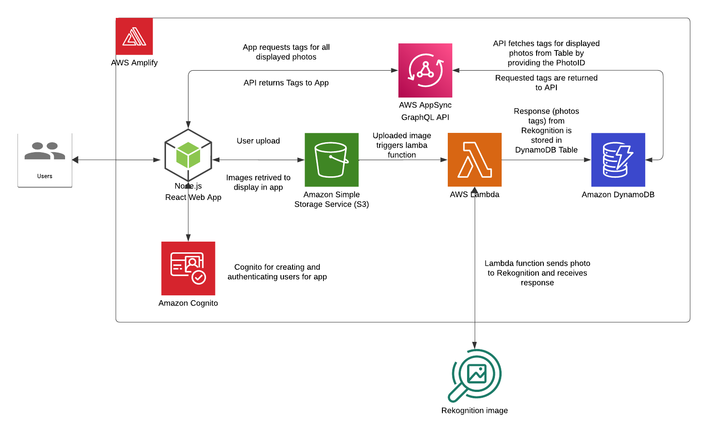

# Image Gallery React App
A responsive web application that allows users to browse, upload, and organize images. Built with React and AWS Amplify, this project demonstrates a cloud-integrated, full-stack approach to web development.

Use the app here: https://main.d136ak8vn4abcb.amplifyapp.com/

## Changelog

### 10 OCT 2024
Updated the look of the app by implementing Material UI so it looks more professional.
- Implemented Material UI React Libary (https://mui.com/)
- Added React-Helmet library and set up the responsive meta tag
- Set the up CSS baseline component from MUI
- Used MUI Button component to change style of buttons
- Deleted unused CSS files

## Architecture Diagram

## Disclaimer
I don't have professional coding experience but I can code thanks to gaining coding skills from a bootcamp. For me it's not the code itself that is my focus. The part I love is problem solving; being able to break down a problem into smaller steps then approach it logically step by step. AI, code repositories,and sites like stack overflow can be leveraged for the code. 

I want to demonstrate my ability to quickly learn and utilize cloud services, and ability to navigate and solve problems I encounter along the way.

I set a high expectation for myself and gave myself a problem - a Cloud project - in order to see how far my problem solving ability could take me. I came across the suggestion of an image gallery, then thought wouldn't it be cool if the images can be analysed by AI and the labels be used as a filtering mechanism to filter the displayed images.

Getting the application to a basic operational state, took me 4 days (2 weekends).

This project was my first time ever using:
- React
- Cognito
- Rekognition
- GraphQL API
- AWS Amplify
- DynamoDB (outside of labs)
- S3 (outside of labs)
- Lambda (outside of labs)

I developed (maybe I get to say I'm a dev) this application before I earned the Solutions Architect Associate certification, so it would be good to revisit this with the lens of best practices under the AWS well architected framework.

## Usage

- Sign up or log in to access your private gallery.
- Upload images using the upload button, and view automatically generated labels.
- Use the search bar to filter images based on tags generated by AWS Rekognition.

## Features
- Image upload functionality with automated analysis and tagging/labelling using AWS Rekognition
- Dynamic filtering and searching of images based on labels
- Cloud-native deployment using AWS services
- Serverless architecture, ensuring scalability and high performance
- User authentication with AWS Cognito for private, secure galleries
- Responsive design for an optimal experience on desktop and mobile devices

## Technologies Used

- **Frontend**: React, JavaScript, HTML5, CSS3
- **Frontend & Backend Management**: AWS Amplify
- **Authentication**: AWS Cognito
- **Storage**: AWS S3
- **Serverless Functions**: AWS Lambda
- **Image Analysis**: AWS Rekognition
- **Database**: AWS DynamoDB
- **API**: AWS AppSync (GraphQL)

## Cloud Integration and Architecture

The application utilizes AWS services to provide a seamless, serverless experience:

- **AWS Amplify** manages the deployment, hosting, and backend integration, simplifying app management.
- **AWS Cognito** handles secure user authentication, ensuring private access to personal galleries.
- **AWS S3** provides scalable and secure storage for uploaded images.
- **AWS Lambda** triggers the analysis of images using AWS Rekognition, automating the tagging process.
- **AWS Rekognition** analyzes images and returns labels, which are stored in DynamoDB for filtering.
- **AWS DynamoDB** stores the labels, allowing quick and efficient querying for image filtering.
- **AWS AppSync (GraphQL)** provides a fast and reliable API for querying image labels and enabling real-time interactions.

## Security Aspects

- **User Authentication**: Managed by AWS Cognito, ensuring secure and isolated user access to galleries.
- **Data Security**: All data is encrypted in transit and at rest within AWS S3 and DynamoDB.
- **Access Control**: IAM roles and policies restrict access to only authorized users and services.
- **API Security**: AWS AppSync integrates with Cognito for secure data queries.

## Scalability

- The app is fully serverless, leveraging AWS services that scale automatically based on demand.
- **AWS S3** and **DynamoDB** scale without manual configuration, handling increased loads seamlessly.
- **AWS Lambda** scales by executing functions only when triggered, ensuring efficient resource use.
- **AWS AppSync** scales API requests dynamically, maintaining performance during high traffic.

## Performance Optimization

- **Serverless Architecture**: Reduces latency by leveraging AWS-managed services, which scale automatically.
- **Optimized Data Retrieval**: AWS DynamoDB and AppSync enable fast, real-time access to image labels.
- **Efficient Image Processing**: AWS Rekognition tags images quickly, maintaining an up-to-date gallery experience.

## CI/CD and Automated Deployment Strategy

- Changes to the github repo are automatically deployed using Amplify.
- **AWS Amplify** provides CI/CD capabilities, automatically deploying changes from the GitHub repository.
- Integrated pipelines manage build, deployment, and testing, ensuring smooth and error-free updates.
- Supports multiple environments for testing and production, minimizing downtime and deployment risks.

## Problem-Solving with Cloud Services

- **Real-Time Image Tagging**: AWS Lambda and Rekognition work together to analyze images asynchronously, improving performance and user experience.
- **Secure User Data Management**: AWS Cognito simplifies secure authentication, protecting private galleries without added complexity.
- **Automatic Scalability**: Serverless services eliminate the need for manual server management, adapting to user demand effortlessly.

### Issues Experienced

The project was a huge undertaking. Almost everything used is new to the me and I only have limited experience of writing JavaScript code.

* React - Had to figure out how to install it and get to know it's structure.
* React app didn't respond in real time to changes in the code because I had the project set up in the Windows file system. Once set up in the Ubuntu file system, it started working correctly.
* Amplify - Had to learn how to use it - referred to documentation and videos.
* Amplify react library - needed to find out which library I needed to install to integrate with with React.
* How to setup user login and authentication using AWS Cognito.
* How to create a file uploader to upload to S3.
* How do user photos stay private in S3.
* How to access files in private level of storage for displaying
* Script for fetching photos from private folder
* Lambda Function not fetching tags from Rekognition, then not storing tags in database. Implemented error logging in the code and analyzed cloudwatch logs for the lambda function. Had to give function Read Access for Rekognition and Full Access for DynamoDB.
* Script for fetchings tags from API. - ended up trying to query wrong table as I thought the Table I had referenced in the Schema was the Dynamo DB table I had set up through Amplify. GraphQL actually creates its own DynamoDB table.
* Leveraged ChatGPT/CoPilot a lot. ChatGPT kept giving code based on the older version of Amplify which did not work. So I referenced the Amplify documentation and when I found what I needed, I input that to ChatGPT so it could give the correct code.

## Considerations for improvement

1. **Handling Unique Filenames:**
   - Currently, the application uses the upload path as the key in the database, and uploaded files retain their original filenames. However, this poses an issue when files with the same name are uploaded to a folder that already contains a file with that name.
   - Additionally, if filenames are identical, the database key won't be unique.
   - To address this, I need to implement a solution to ensure that every uploaded file is considered unique, even if it already exists.
  &nbsp;

2. **Filtering Rekognition Tags:**
   - The application currently displays all tags returned by Rekognition for a given image. However, some tags have low confidence scores and may be inaccurate.
   - To improve accuracy and enhance the user experience, I should include only high-confidence tags, filtering out unreliable ones.
  &nbsp;

3. **Workflow Order Adjustment:**
   - The lambda function triggered when a photo is uploaded. This might be an unoptimized order/sequence. At the moment the tags/labels for a given image will not appear in the gallery unless they are present in DynamoDB. Sometimes Rekognition takes longer than expected to return the labels. I think the current solution is fine, as it does not prevent the app from being used while the image is still being analyzed. The user may wonder why the tags did not appear and attempt to upload the image again. This is something I need to think about.
  &nbsp;

4. **Enhancing Photo Sharing:**
   - Photos are uploaded to a private-level folder in S3, limiting access to the logged-in user.
   - To enable photo sharing, I can introduce different folders in S3 with varying access levels. Some folders could allow any logged-in user to view photos, facilitating a photo-sharing feature.
  &nbsp;

6. **Style and theme**
    - Use React components and libraries such as Material UI to give the app a professional look and user experience. https://mui.com/material-ui/

## Contributing
Contributions are welcome! Please fork the repository and create a pull request for any major changes.

## Contact
Created by [Abdurrahman Raja (Abz)](https://www.linkedin.com/in/abz-raja) - feel free to reach out!
